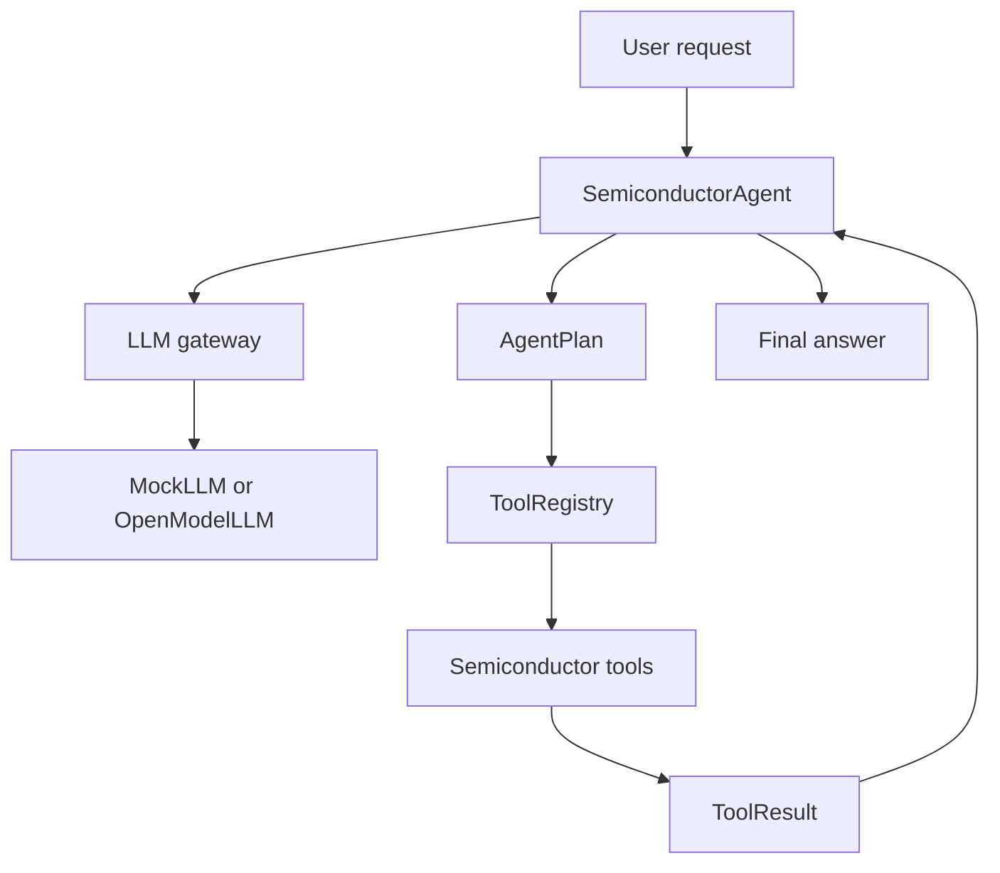
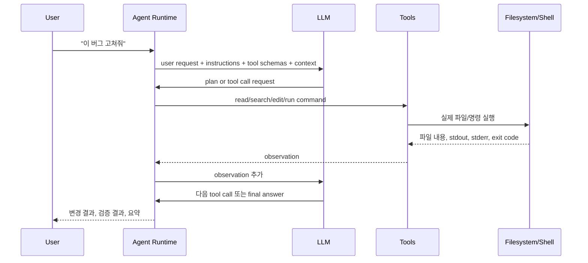
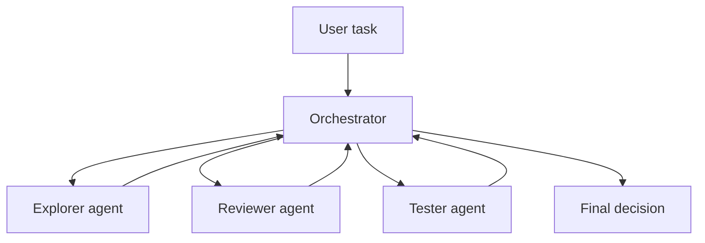
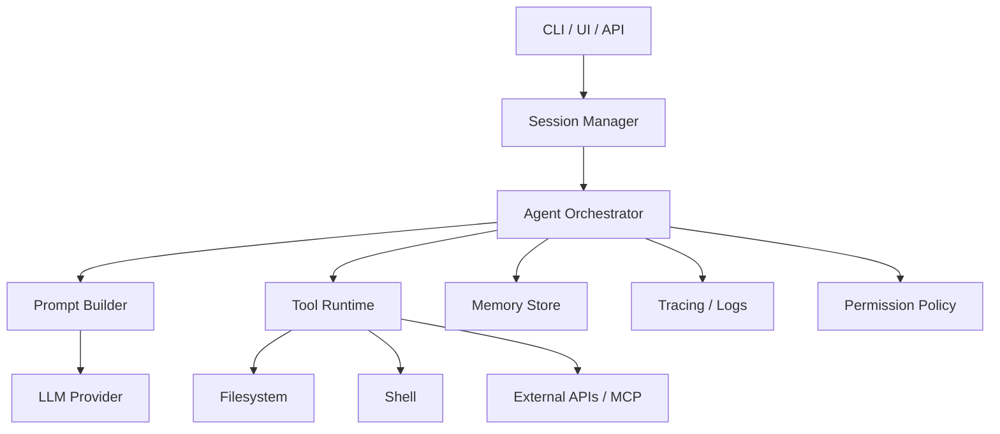

# Semiconductor Agent Guide

이 문서는 `semicon-agent` 프로젝트를 이해하고 확장하기 위한 운영 가이드다.
현재 구현은 production 분석 엔진이 아니라, LLM 기반 Agent 프레임워크를 검증하기
위한 MVP 구조다.

처음 보는 사람은 이 문서부터 바로 읽기보다
[`BEGINNER_GUIDE.md`](BEGINNER_GUIDE.md)를 먼저 읽는 것이 좋다. 입문 문서는 설치,
첫 실행, sample data, CLI/API 사용법, 코드 읽는 순서, 문제 해결을 단계적으로 설명한다.
검증 결과와 남은 개선 backlog는 [`IMPROVEMENT_AUDIT.md`](IMPROVEMENT_AUDIT.md)에
정리되어 있다.

## 1. 목적

이 프로젝트의 목적은 반도체 데이터 분석 업무에서 사용할 수 있는 Agent 구조를
Python으로 구성하는 것이다.

현재 우선순위는 다음 순서다.

1. LLM 교체가 쉬운 구조
2. Agent가 tool을 선택하고 실행하는 구조
3. 반도체 분석 업무에 맞는 tool registry 구조
4. mock LLM으로 로컬 테스트 가능
5. 나중에 open-model API로 연결 가능

반도체 분석 함수는 현재 demo 수준이다. 실제 분석 정확도보다 Agent 흐름 검증이
중요하다.

## 2. 현재 상태

구현된 구성은 다음과 같다.

- `MockLLM`: 로컬 테스트용 deterministic LLM 대체 구현
- `OpenModelLLM`: OpenAI-compatible `/chat/completions` API adapter
- `SemiconductorAgent`: plan, tool execution, final synthesis 실행 코어
- `ToolRegistry`: Python 함수를 tool로 등록하고 실행
- `ToolRuntime`: argument validation, path policy, permission policy 적용
- `ExecutionPolicy`: tool risk와 data path boundary 관리
- `ApprovalProvider`: risky tool 실행 전 승인 workflow
- `TraceRecorder`: redacted run event 기록
- `SQLiteRunStore`: run/session history 저장
- `AgentSettings`: CLI/server 공통 환경 설정
- `ArtifactStore`: upload/report/self-check artifact 저장
- `StreamingLLM`: streaming-ready synthesis provider protocol
- FastAPI server: `semicon_agent/server/api.py`
- Web UI: `GET /`
- API status: `GET /api/status`
- `semiconductor.py`: profile, yield, SPC, anomaly, correlation, report demo tools
- CLI: `python -m semicon_agent`
- self-check: `python -m semicon_agent.self_check`
- tests: pytest 기반 기본 회귀 테스트

아직 구현하지 않은 주요 항목은 다음과 같다.

- workflow graph executor
- tracing dashboard
- RAG/document ingestion
- background worker / async job queue
- auth boundary
- production semiconductor analytics

## 3. 아키텍처



핵심 원칙은 LLM과 분석 함수를 분리하는 것이다. LLM은 어떤 tool을 호출할지
계획하고, 실제 계산은 Python tool이 담당한다.

## 3-1. Codex/Claude Code 같은 Coding Agent의 작동 원리

Codex, Claude Code 같은 도구는 단순한 챗봇이 아니다. 핵심은 LLM을 중심에 두고,
파일 읽기, 검색, 코드 수정, 명령 실행, 테스트, 브라우저 조작, 외부 시스템 조회 같은
기능을 tool로 연결한 agent runtime이다.

정확한 내부 prompt, 모델 weight, ranking 로직, 제품별 orchestration 세부 구현은
공개되어 있지 않다. 따라서 이 절은 특정 제품의 비공개 구현을 추측하지 않는다.
대신 공식 문서에서 확인 가능한 동작 방식과, 우리가 Python으로 구현할 수 있는
일반적인 coding agent 아키텍처를 기준으로 설명한다.

공식 문서 기준으로 볼 때 Codex는 코드를 읽고, 수정하고, 실행할 수 있는 coding
agent로 설명된다. Claude Code도 코드베이스를 읽고, 파일을 수정하고, 명령을
실행하고, 개발 도구와 통합되는 agentic coding tool로 설명된다. 두 제품의 공통
핵심은 다음이다.

1. 사용자의 목표를 이해한다.
2. 현재 코드베이스와 환경 정보를 수집한다.
3. 필요한 작업을 계획한다.
4. shell, file edit, search, test 같은 tool을 호출한다.
5. tool 결과를 다시 읽고 다음 행동을 결정한다.
6. 코드 변경 후 테스트와 검증을 실행한다.
7. 최종 결과를 사용자에게 요약한다.

### 3-1-1. 가장 중요한 개념: LLM은 직접 컴퓨터를 조작하지 않는다

LLM 자체는 텍스트를 입력받고 텍스트를 출력하는 모델이다. 모델이 실제로 파일을
열거나, 코드를 수정하거나, 테스트를 실행하는 것이 아니다.

실제 실행 구조는 다음과 같다.



즉 agent의 실체는 두 부분이다.

- `LLM`: 판단, 계획, 코드 생성, 설명을 담당한다.
- `Runtime`: LLM의 요청을 안전하게 실행하고 결과를 다시 LLM에게 전달한다.

우리가 만든 `semicon-agent`도 같은 구조를 따른다.

- `MockLLM` 또는 `OpenModelLLM`: 판단 계층
- `SemiconductorAgent`: runtime/orchestrator
- `ToolRegistry`: tool 실행 계층
- `semiconductor.py`: 실제 Python tool

### 3-1-2. Agent loop

Coding agent의 기본 루프는 다음과 같다.

```text
사용자 요청
  -> 현재 상태/context 수집
  -> LLM에게 다음 행동 요청
  -> tool 실행
  -> 결과 관찰
  -> 필요하면 다시 계획
  -> 코드 수정
  -> 테스트/검증
  -> 최종 응답
```

이 루프를 ReAct 패턴으로 볼 수 있다.

- Reason: 지금 무엇을 해야 하는지 판단
- Act: tool 실행
- Observe: tool 결과 확인
- Repeat: 목표 달성까지 반복

중요한 점은 agent가 처음부터 완벽한 답을 내는 구조가 아니라는 것이다. 좋은 coding
agent는 중간 결과를 확인하면서 방향을 수정한다. 예를 들어 테스트가 실패하면 실패
로그를 다시 읽고, 원인을 추론하고, 코드를 다시 수정한다.

### 3-1-3. Prompt에는 무엇이 들어가는가

LLM이 좋은 행동을 하려면 prompt에 충분한 운영 정보가 들어가야 한다.

일반적인 coding agent prompt는 다음 요소들로 구성된다.

| 구성 요소 | 역할 |
| --- | --- |
| System instructions | agent의 역할, 안전 규칙, 코딩 스타일 |
| Developer instructions | 제품/조직/프로젝트 차원의 운영 규칙 |
| User request | 사용자가 원하는 실제 작업 |
| Tool schemas | 사용 가능한 tool 이름, 설명, 입력 schema |
| Repo context | 파일 목록, 관련 코드, 테스트 결과 |
| Observations | 이전 tool 실행 결과 |
| Memory/instructions files | `AGENTS.md`, `CLAUDE.md` 같은 지속 지침 |

LLM은 이 정보를 보고 다음 중 하나를 선택한다.

- 추가 파일을 읽는다.
- 코드를 검색한다.
- 수정 계획을 세운다.
- 파일을 변경한다.
- 테스트를 실행한다.
- 사용자에게 질문한다.
- 최종 답변을 한다.

이 프로젝트에서는 `OpenModelLLM.plan()`이 prompt를 만들어 open-model API에 보낸다.
현재는 단순히 tool 목록과 context를 JSON으로 전달한다. 풀패키지로 확장하려면
prompt 구성도 더 엄격하게 나누는 것이 좋다.

예시:

```text
SYSTEM:
You are a semiconductor data analysis agent.
Use tools only when necessary.
Return JSON matching AgentPlan.

TOOLS:
- dataset_profile(path)
- yield_summary(path)
- spc_summary(path)

CONTEXT:
- data_path: examples/sample_wafer.csv

USER:
analyze yield and SPC
```

### 3-1-4. Tool calling의 실제 의미

Tool calling은 LLM이 Python 함수를 직접 실행한다는 뜻이 아니다. LLM은 보통 다음과
같은 구조화된 요청을 출력한다.

```json
{
  "tool_calls": [
    {
      "name": "yield_summary",
      "arguments": {
        "path": "examples/sample_wafer.csv"
      }
    }
  ]
}
```

그 다음 runtime이 이 요청을 검증하고 실제 함수를 실행한다.

```python
tool = registry.get("yield_summary")
result = tool.run({"path": "examples/sample_wafer.csv"})
```

여기서 중요한 보안 원칙은 다음이다.

- LLM이 준 tool name을 그대로 신뢰하지 않는다.
- registry에 등록된 tool만 실행한다.
- arguments는 schema로 검증한다.
- 위험한 tool은 human approval을 요구한다.
- 파일 경로는 허용된 workspace 안인지 확인한다.
- path 기반 tool은 `ToolRegistry.run()`으로 직접 실행하지 않고 `ToolRuntime`을 거친다.

현재 `semicon-agent`는 MVP라서 schema validation과 permission layer가 약하다.
풀패키지로 만들려면 이 부분을 먼저 강화해야 한다.

### 3-1-5. File edit는 어떻게 일어나는가

Coding agent는 보통 다음 순서로 파일을 수정한다.

1. 관련 파일을 찾는다.
2. 파일 일부 또는 전체를 읽는다.
3. 수정 위치를 결정한다.
4. patch를 생성한다.
5. patch를 적용한다.
6. 다시 파일을 읽어 적용 상태를 확인한다.
7. 테스트나 lint를 실행한다.

이 구조에서 LLM은 patch text를 만든다. 실제 파일 변경은 runtime이 한다.

일반적인 patch 예시는 다음과 같다.

```diff
 def calculate_yield(pass_count: int, total_count: int) -> float:
-    return pass_count / total_count * 100
+    if total_count == 0:
+        return 0.0
+    return pass_count / total_count * 100
```

좋은 coding agent는 파일 전체를 무작정 다시 쓰지 않는다. 변경 범위를 작게 유지하고,
기존 스타일에 맞춘다. 이 원칙은 코드 품질보다도 안전성 때문에 중요하다. 큰 변경은
충돌, 회귀, 의도하지 않은 삭제 가능성을 키운다.

### 3-1-6. Shell command는 왜 중요한가

LLM은 코드가 실제로 동작하는지 자체적으로 알 수 없다. 따라서 agent는 shell command를
통해 환경을 확인한다.

대표적인 command는 다음과 같다.

| Command | 목적 |
| --- | --- |
| `rg` | 빠른 코드 검색 |
| `git status` | 변경 범위 확인 |
| `python -m pytest` | 테스트 실행 |
| `python -m package` | CLI 동작 확인 |
| `npm test` | JS/TS 테스트 |
| `ruff`, `mypy`, `eslint` | 정적 검사 |

중요한 점은 stdout/stderr/exit code가 다시 LLM context로 들어간다는 것이다. LLM은
실패 로그를 읽고 다음 수정을 판단한다.

예시 루프:

```text
1. 코드 수정
2. pytest 실행
3. 실패 로그 확인
4. 실패 원인 추론
5. 코드 재수정
6. pytest 재실행
```

이 루프가 없으면 agent는 “그럴듯한 코드”만 만들고 멈춘다. 실제 coding agent의
품질은 테스트 실행과 실패 복구 능력에서 크게 갈린다.

### 3-1-7. Context 수집 방식

Coding agent는 전체 코드베이스를 항상 다 읽지 않는다. 대부분의 프로젝트는 context
window보다 크기 때문이다. 그래서 관련 정보를 단계적으로 수집한다.

일반적인 순서는 다음과 같다.

1. 파일 목록 확인
2. 키워드 검색
3. 관련 파일 읽기
4. import/call graph 추적
5. 테스트 파일 확인
6. 설정 파일 확인
7. 필요한 만큼 추가 탐색

예를 들어 "yield 계산 버그 고쳐줘"라는 요청이 오면 agent는 다음을 찾는다.

- `yield` 문자열이 들어간 파일
- 관련 함수 정의
- 해당 함수의 테스트
- CLI에서 그 함수를 호출하는 경로
- 샘플 데이터

이 방식은 사람이 코드베이스를 탐색하는 방식과 유사하다.

### 3-1-8. Memory는 마법이 아니다

Agent의 memory는 보통 세 종류로 나뉜다.

| 종류 | 설명 | 예시 |
| --- | --- | --- |
| Short-term context | 현재 대화/작업 중 prompt에 들어간 내용 | 방금 읽은 파일, 테스트 로그 |
| Project instructions | repo에 저장된 지속 지침 | `AGENTS.md`, `CLAUDE.md` |
| Persistent memory | 세션 밖에 저장되는 사용자/프로젝트 선호 | SQLite, JSON, vector DB |

많은 사용자가 "agent가 전에 말한 것을 기억하겠지"라고 생각하지만, 실제로는 runtime이
그 내용을 prompt에 다시 넣어줘야 한다. prompt에 들어가지 않은 정보는 모델이 사용할
수 없다.

따라서 production agent를 만들 때는 memory를 명시적으로 설계해야 한다.

- 무엇을 저장할 것인가
- 어디에 저장할 것인가
- 언제 다시 불러올 것인가
- 오래된 memory를 어떻게 폐기할 것인가
- 민감 정보를 저장해도 되는가

현재 `semicon-agent`에는 persistent memory가 없다. 다음 단계에서는 SQLite run store를
추가하는 것이 현실적인 첫 확장이다.

### 3-1-9. Permissions와 sandbox

Coding agent는 강력한 tool을 사용할 수 있기 때문에 권한 관리가 필요하다.

위험도가 낮은 tool:

- 파일 읽기
- 코드 검색
- 테스트 실행
- git diff 확인

위험도가 높은 tool:

- 파일 삭제
- 외부 네트워크 전송
- credential 접근
- database write
- 배포
- 결제/메일/메신저 전송
- `rm -rf`, `git reset --hard` 같은 destructive command

좋은 agent runtime은 tool마다 permission level을 둔다.

```text
read_file          -> allow
search_code        -> allow
run_tests          -> allow
edit_file          -> allow or confirm
delete_file        -> confirm
deploy_production  -> confirm
send_email         -> confirm
```

이 프로젝트도 풀패키지로 확장하려면 `ToolSpec`에 다음 필드를 추가하는 것이 좋다.

```python
danger_level: Literal["safe", "write", "destructive", "external"]
requires_approval: bool
```

그리고 `SemiconductorAgent`가 tool 실행 전에 approval policy를 확인해야 한다.

### 3-1-10. Plan mode와 Act mode

많은 agent는 내부적으로 planning과 acting을 구분한다.

Plan mode:

- 문제를 이해한다.
- 코드베이스를 읽는다.
- 접근 전략을 세운다.
- 아직 파일을 바꾸지 않는다.

Act mode:

- 파일을 수정한다.
- 명령을 실행한다.
- 테스트를 돌린다.
- 결과를 반영한다.

이 구분은 사용자 신뢰와 안전성 때문에 중요하다. 대규모 변경이나 위험한 작업에서는
먼저 계획을 보여주고 승인을 받은 뒤 실행하는 편이 안전하다.

현재 `semicon-agent`는 항상 act에 가깝다. 향후에는 다음과 같이 분리할 수 있다.

```powershell
python -m semicon_agent plan "analyze this dataset" --data data.csv
python -m semicon_agent run "analyze this dataset" --data data.csv
```

### 3-1-11. Subagent 구조

복잡한 작업은 하나의 agent가 전부 처리하는 것보다 역할을 나누는 것이 유리하다.

예시:

| Subagent | 역할 |
| --- | --- |
| Explorer | 코드베이스 탐색 |
| Implementer | 코드 수정 |
| Reviewer | 변경사항 검토 |
| Tester | 테스트 실행과 실패 분석 |
| Researcher | 외부 문서 확인 |
| Data Analyst | 데이터 분석 tool 실행 |

Subagent 구조의 장점은 병렬화와 전문화다. 단점은 orchestration이 복잡해지고, 각
agent의 결과를 합치는 비용이 생긴다는 것이다.

일반적인 subagent 흐름:



`semicon-agent`에서는 나중에 다음 구조로 확장할 수 있다.

- `DataProfileAgent`
- `YieldAnalysisAgent`
- `ReportAgent`
- `ReviewAgent`
- `WorkflowOrchestrator`

하지만 초기에는 단일 agent와 tool registry가 더 단순하고 유지보수하기 쉽다.

### 3-1-12. MCP와 외부 도구 연결

MCP(Model Context Protocol)는 agent가 외부 시스템을 일관된 방식으로 사용할 수 있게
하는 연결 계층으로 볼 수 있다. 예를 들어 GitHub, 문서 저장소, 데이터베이스, 사내
시스템을 tool처럼 붙일 수 있다.

MCP를 쓰면 agent 입장에서는 다음처럼 보인다.

```text
github.get_pull_request()
github.list_review_comments()
database.query()
docs.search()
```

즉 agent runtime이 직접 모든 API client를 구현하지 않아도 된다. 외부 시스템을 MCP
server가 감싸고, agent는 tool schema를 통해 호출한다.

반도체 업무에서는 다음 MCP/tool 연결이 유용할 수 있다.

- GitHub/GitLab: 분석 코드와 issue 연결
- 사내 문서 검색: 공정/장비/recipe 문서 검색
- 데이터베이스: lot/wafer/test 결과 조회
- 파일 서버: 측정 데이터 다운로드
- BI 시스템: 리포트 업로드

### 3-1-13. Hooks와 lifecycle

Hook은 agent 실행 중 특정 시점에 자동으로 실행되는 규칙이다.

예시:

| 시점 | Hook 예시 |
| --- | --- |
| 세션 시작 | 프로젝트 지침 주입 |
| 파일 수정 후 | formatter 실행 |
| shell 실행 전 | 위험 명령 차단 |
| 테스트 실패 후 | 로그 저장 |
| 응답 전 | 요약 형식 검사 |

Hook은 agent의 품질을 안정화하는 데 중요하다. LLM에게 모든 규칙을 prompt로만 지키게
하는 것은 약하다. 가능한 것은 runtime hook으로 강제하는 편이 낫다.

예를 들어 Python 프로젝트라면 파일 수정 후 자동으로 다음을 실행할 수 있다.

```powershell
ruff format .
python -m pytest
```

반도체 데이터 분석 agent라면 다음 hook이 유용하다.

- 데이터 파일 로드 전 경로 검증
- 대용량 파일이면 sampling 우선 실행
- 결과 artifact 자동 저장
- 민감 컬럼 masking
- 외부 API 전송 전 승인 요청

### 3-1-14. Coding agent가 실수하는 이유

Coding agent의 실수는 대부분 다음 원인에서 나온다.

1. 관련 파일을 충분히 읽지 않았다.
2. 테스트를 실행하지 않았다.
3. tool 결과를 잘못 해석했다.
4. 오래된 context를 최신 상태로 착각했다.
5. 비슷한 API를 헷갈렸다.
6. 파일 변경 범위가 너무 컸다.
7. 사용자 요구사항을 너무 넓게 해석했다.
8. 실패 로그를 무시하고 추측으로 수정했다.

이를 줄이는 방법은 명확하다.

- 먼저 repo 구조를 읽는다.
- 관련 파일만 좁게 수정한다.
- 테스트를 반드시 실행한다.
- 실패하면 로그를 기준으로 수정한다.
- tool 결과와 추론을 구분한다.
- 불확실하면 질문하거나 assumption을 명시한다.

이 원칙은 이 프로젝트의 개발 방식에도 그대로 적용해야 한다.

### 3-1-15. 좋은 coding agent runtime의 구성 요소

풀패키지 coding agent runtime은 최소한 다음 계층을 가진다.



각 계층의 책임은 다음과 같다.

| 계층 | 책임 |
| --- | --- |
| CLI/UI/API | 사용자 입력과 출력 |
| Session Manager | 대화, 작업, 실행 상태 관리 |
| Orchestrator | plan-act-observe loop 제어 |
| Prompt Builder | LLM 입력 구성 |
| LLM Provider | 모델 API 호출 |
| Tool Runtime | tool validation, execution, observation |
| Memory Store | run history, project memory 저장 |
| Permission Policy | 위험 작업 차단/승인 |
| Tracing | 어떤 판단과 tool 실행이 있었는지 기록 |

현재 `semicon-agent`와 비교하면 다음과 같다.

| 필요한 계층 | 현재 구현 |
| --- | --- |
| CLI | 있음 |
| Session Manager | SQLite run store 있음 |
| Orchestrator | 기본 구현 있음 |
| Prompt Builder | `OpenModelLLM` 내부에 단순 구현 |
| LLM Provider | Mock/Open-model 있음 |
| Tool Runtime | validation/policy/path boundary 있음 |
| Memory Store | run history 저장 있음 |
| Permission Policy | risk level gate 있음 |
| Tracing | redacted run event 있음 |

따라서 다음 단계에서 "Codex/Claude Code 같은 구조"에 더 가까워지려면 다음 세 가지가
우선이다.

1. workflow graph executor
2. provider별 true streaming 구현
3. graph workflow/resumable approval

session/run store, permission policy, tracing/logging은 core v1에 들어갔다. core v2에는
bounded multi-step orchestration, approval provider, streaming-ready interface가 들어갔다.
core v3에는 FastAPI server, simple web UI, artifact upload/report store가 들어갔다.
core v4 보강에는 공통 설정, serverless self-check, 실패 run persistence, API status,
client-side LLM/risk config guard, path field policy가 들어갔다.

### 3-1-16. Semicon Agent에 적용할 설계 방향

우리 프로젝트에 바로 적용 가능한 구조는 다음이다.

```text
semicon_agent/
  config.py               # shared runtime settings
  self_check.py           # serverless end-to-end verification
  core/
    agent.py              # orchestrator
    approval.py           # human/programmatic approvals
    artifacts.py          # saved uploads/reports/check artifacts
    session.py            # run/session state
    policy.py             # permission rules
    trace.py              # event logging
  llm/
    base.py
    mock.py
    open_model.py
    ollama.py
    vllm.py
  tools/
    base.py
    registry.py
    semiconductor.py
    filesystem.py
    shell.py
  workflows/
    graph.py
    nodes.py
  server/
    api.py
  ui/
    streamlit_app.py
```

우선순위는 다음이 현실적이다.

1. `RunEvent` 모델 추가
2. SQLite 기반 run history 저장
3. `ToolSpec`에 위험도 필드 추가
4. tool argument validation 강화
5. bounded multi-step orchestration 추가
6. streaming 가능한 LLM provider interface
7. FastAPI endpoint 추가 - core v3 완료
8. 간단한 web UI 추가 - core v3 완료
9. serverless self-check와 API guard 추가 - core v4 보강 완료

반도체 분석 함수 자체는 나중 문제다. 중요한 것은 agent platform이 안전하고
관찰 가능하며 교체 가능해야 한다는 점이다.

### 3-1-17. 이 프로젝트와 Codex/Claude Code의 차이

현재 `semicon-agent`는 Codex나 Claude Code와 같은 수준의 coding agent가 아니다.
차이는 명확하다.

| 항목 | Codex/Claude Code 계열 | 현재 semicon-agent |
| --- | --- | --- |
| 코드베이스 탐색 | 강함 | 제한적 |
| 파일 수정 | 가능 | 아직 없음 |
| shell 실행 | 가능 | 아직 없음 |
| 테스트 자동 실행 | 가능 | 수동/CLI 수준 |
| 권한 관리 | 제품 차원 제공 | policy + approval provider 있음 |
| memory | 제품별 지원 | SQLite run history 있음 |
| hooks | 제품별 지원 | 없음 |
| subagents | 제품별 지원 | 없음 |
| tracing | 제품별 지원 | redacted event trace 있음 |
| 도메인 tool | 사용자가 확장 | demo 수준 |

따라서 이 프로젝트의 다음 목표는 분석 함수를 정교하게 만드는 것이 아니라, coding
agent runtime의 핵심 계층을 하나씩 추가하는 것이다.

### 3-1-18. 공식 문서 참고

제품별 최신 기능은 계속 바뀐다. 세부 기능은 항상 공식 문서를 기준으로 확인해야 한다.

- OpenAI Codex: <https://developers.openai.com/codex>
- Codex IDE extension: <https://developers.openai.com/codex/ide>
- Codex web/cloud: <https://developers.openai.com/codex/cloud>
- Codex subagents: <https://developers.openai.com/codex/subagents>
- Codex best practices: <https://developers.openai.com/codex/learn/best-practices>
- Codex AGENTS.md: <https://developers.openai.com/codex/guides/agents-md>
- Codex skills: <https://developers.openai.com/codex/skills>
- Claude Code overview: <https://docs.anthropic.com/en/docs/claude-code/overview>
- Claude Code settings/tools: <https://docs.anthropic.com/en/docs/claude-code/settings>
- Claude Code memory: <https://docs.anthropic.com/en/docs/claude-code/memory>
- Claude Code hooks guide: <https://docs.anthropic.com/en/docs/claude-code/hooks-guide>
- Claude Code subagents: <https://docs.anthropic.com/en/docs/claude-code/sub-agents>

## 4. 설치

프로젝트 루트에서 실행한다.

```powershell
python -m pip install -e ".[dev]"
```

필수 런타임 의존성은 다음과 같다.

- pandas
- numpy
- pydantic

개발용 의존성은 다음과 같다.

- pytest
- openpyxl
- fastapi
- uvicorn
- httpx
- python-multipart

## 5. 실행

샘플 데이터로 수율과 SPC demo 분석을 실행한다.

```powershell
python -m semicon_agent "analyze yield and SPC" --data examples/sample_wafer.csv
```

종합 리포트를 실행한다.

```powershell
python -m semicon_agent "create an overall report" --data examples/sample_wafer.csv
```

전체 실행 payload를 JSON으로 확인한다.

```powershell
python -m semicon_agent "create an overall report" --data examples/sample_wafer.csv --json
```

`--json`은 기본적으로 경로와 민감 키를 redaction한다. 원시 payload가 필요한 개발
상황에서는 `--unsafe-json`을 명시한다.

최근 실행 목록:

```powershell
python -m semicon_agent --list-runs
```

특정 실행 trace 확인:

```powershell
python -m semicon_agent --show-trace <run_id>
```

위험도가 높은 tool을 승인하려면 risk level을 명시한다.

```powershell
python -m semicon_agent "run approved task" --approve-risk external
```

모든 risk level을 승인하는 `--yes`는 개발/테스트 상황에서만 사용한다.

서버 없이 end-to-end 상태를 확인하려면 self-check를 실행한다.

```powershell
python -m semicon_agent.self_check --data examples/sample_wafer.csv
```

editable install 후에는 console script도 사용할 수 있다.

```powershell
semicon-agent-check --data examples/sample_wafer.csv
```

self-check는 `MockLLM`, agent loop, tool execution, SQLite run store, artifact store가
같이 동작하는지 확인한다. 서버를 띄우지 않고 CI smoke test로 쓰기 좋다.

## 6. API server와 설정

로컬 API server와 Web UI는 다음처럼 실행한다.

```powershell
python -m semicon_agent.server --host 127.0.0.1 --port 8008 --allow-root examples
```

주요 endpoint는 다음과 같다.

| Endpoint | 역할 |
| --- | --- |
| `GET /health` | 최소 health check |
| `GET /api/status` | tool 수, artifact 수, run 수 같은 runtime 상태 |
| `GET /` | 간단한 Web UI |
| `POST /api/artifacts` | CSV/Excel 등 데이터 업로드 |
| `GET /api/artifacts` | artifact 목록 |
| `GET /api/artifacts/{name}` | artifact 다운로드 |
| `POST /api/runs` | agent 실행 |
| `GET /api/runs` | 최근 run 목록 |
| `GET /api/runs/{run_id}` | run 상태와 최종 답변 |
| `GET /api/runs/{run_id}/trace` | 저장된 trace event |
| `POST /api/jobs` | background job 생성 |
| `GET /api/jobs` | 최근 job 목록 |
| `GET /api/jobs/{job_id}` | job 상태 조회 |

API server의 기본 정책은 local-first다.

- 클라이언트가 `base_url`, `api_key`, `allow_remote_llm`을 직접 넘기는 것은 기본 차단한다.
- 클라이언트가 `approve_risks`로 risk approval을 직접 여는 것도 기본 차단한다.
- `/api/status`는 기본적으로 절대 경로를 숨긴다.
- 상세 경로 상태는 `--debug-status`를 명시한 경우에만 노출한다.

운영자가 의도적으로 client-side LLM 설정을 허용하려면 다음 flag를 명시한다.

```powershell
python -m semicon_agent.server --allow-client-llm-config
```

운영자가 의도적으로 client-side risk approval을 허용하려면 다음 flag를 명시한다.

```powershell
python -m semicon_agent.server --allow-client-risk-approval
```

공통 환경 변수는 다음과 같다.

| 변수 | 역할 |
| --- | --- |
| `SEMICON_AGENT_SESSION_DB` | SQLite run/session DB path |
| `SEMICON_AGENT_ARTIFACT_ROOT` | artifact 저장 root |
| `SEMICON_AGENT_ALLOWED_ROOTS` | 추가 data root 목록. OS path separator로 구분 |
| `SEMICON_AGENT_MAX_STEPS` | 기본 max plan/act step |
| `SEMICON_AGENT_ALLOW_REMOTE_LLM` | 서버 측 remote LLM 허용 여부 |
| `OPEN_MODEL_BASE_URL` | open-model API base URL |
| `OPEN_MODEL_NAME` | open-model model name |
| `OPEN_MODEL_API_KEY` | open-model API key |

## 7. Open-model API 연결

`OpenModelLLM`은 OpenAI-compatible chat completions API를 가정한다.

필요 조건은 다음과 같다.

- `POST /chat/completions`
- request body에 `model`, `messages`, `temperature` 지원
- response body에 `choices[0].message.content` 반환

실행 예시:

```powershell
$env:OPEN_MODEL_API_KEY="..."
python -m semicon_agent "analyze yield" `
  --data examples/sample_wafer.csv `
  --llm open-model `
  --base-url http://localhost:8000/v1 `
  --model my-open-model
```

환경변수로도 설정할 수 있다.

```powershell
$env:OPEN_MODEL_BASE_URL="http://localhost:8000/v1"
$env:OPEN_MODEL_NAME="my-open-model"
$env:OPEN_MODEL_API_KEY="..."
```

localhost가 아닌 endpoint는 HTTPS여야 하며, CLI에서 `--allow-remote-llm`을 명시해야
한다. 기본값은 외부 endpoint 차단이다.

서버에서 server-side open-model profile을 사용하려면 다음처럼 설정한다.

```powershell
$env:OPEN_MODEL_BASE_URL="http://localhost:8000/v1"
$env:OPEN_MODEL_NAME="my-open-model"
python -m semicon_agent.server --default-llm open-model
```

## 8. 주요 코드 위치

| 영역 | 파일 |
| --- | --- |
| Agent core | `semicon_agent/core/agent.py` |
| Approval workflow | `semicon_agent/core/approval.py` |
| Execution policy | `semicon_agent/core/policy.py` |
| Trace events | `semicon_agent/core/trace.py` |
| SQLite run store | `semicon_agent/core/session.py` |
| 설정 | `semicon_agent/config.py` |
| 실행 모델 | `semicon_agent/models.py` |
| LLM protocol | `semicon_agent/llm/base.py` |
| Mock LLM | `semicon_agent/llm/mock.py` |
| Open-model adapter | `semicon_agent/llm/open_model.py` |
| Tool base | `semicon_agent/tools/base.py` |
| Tool registry | `semicon_agent/tools/registry.py` |
| Tool runtime | `semicon_agent/tools/runtime.py` |
| Tool validation | `semicon_agent/tools/validation.py` |
| Semiconductor demo tools | `semicon_agent/tools/semiconductor.py` |
| CLI | `semicon_agent/cli.py` |
| FastAPI server | `semicon_agent/server/api.py` |
| Server runner | `semicon_agent/server/__main__.py` |
| Artifact store | `semicon_agent/core/artifacts.py` |
| Self-check | `semicon_agent/self_check.py` |
| Tests | `tests/` |

## 9. Agent 실행 흐름

1. 사용자가 자연어 요청을 입력한다.
2. `SemiconductorAgent.run()`이 context를 만든다.
3. LLM이 `AgentPlan`을 반환한다.
4. `AgentPlan.tool_calls`에 있는 tool을 순서대로 실행한다.
5. `ToolRuntime`이 schema validation, path policy, permission policy를 적용한다.
6. risky tool은 `ApprovalProvider`를 통해 승인/거절된다.
7. 각 실행 결과는 `ToolResult`로 저장된다.
8. `max_steps` 범위 안에서 필요하면 다시 planning한다.
9. 주요 단계는 `RunEvent`로 기록되고 SQLite run store에 저장된다.
10. LLM이 tool 결과를 받아 최종 응답을 만든다.

현재 `MockLLM`은 keyword 기반으로 tool을 선택한다. 실제 LLM을 연결하면 모델이
tool 설명과 schema를 보고 tool call 계획을 생성한다.

## 10. Tool 추가 방법

새 tool은 다음 순서로 추가한다.

1. Python 함수를 만든다.
2. `ToolSpec`으로 name, description, parameters, handler를 정의한다.
3. `build_semiconductor_tools()`에 등록한다.
4. mock LLM keyword rule이 필요하면 `MockLLM.plan()`에 추가한다.
5. tests를 추가한다.

예시:

```python
def wafer_map_summary(path: str) -> dict[str, object]:
    df = load_table(path)
    return {
        "kind": "wafer_map_summary",
        "row_count": len(df),
    }
```

등록 예시:

```python
ToolSpec(
    name="wafer_map_summary",
    description="Demo tool: summarize wafer map data.",
    parameters={
        "type": "object",
        "properties": {"path": {"type": "string"}},
        "required": ["path"],
    },
    handler=wafer_map_summary,
    risk_level="read",
    data_access=("table",),
)
```

## 11. 입력 데이터 계약

현재 demo tool이 기대하는 입력 데이터는 table 형태다.

지원하는 파일 형식은 다음과 같다.

- `.csv`
- `.tsv`
- `.txt`
- `.xlsx`
- `.xls`

역할 추정에 사용하는 대표 column 이름은 다음과 같다.

| 역할 | 후보 column |
| --- | --- |
| lot | `lot_id`, `lot`, `batch` |
| wafer | `wafer_id`, `wafer` |
| bin | `hard_bin`, `soft_bin`, `bin` |
| pass/fail | `is_pass`, `pass`, `result`, `status` |

pass/fail 판정 규칙은 다음 순서로 적용된다.

1. `is_pass`, `pass`, `result`, `status` 중 하나가 있으면 그 column을 사용한다.
2. boolean column이면 `True`를 pass로 본다.
3. numeric column이면 `0`이 아닌 값을 pass로 본다.
4. string column이면 `pass`, `passed`, `ok`, `good`, `true`, `1`, `y`, `yes`를 pass로 본다.
5. pass/fail column이 없고 `hard_bin`, `soft_bin`, `bin`이 있으면 `bin == 1`을 pass로 본다.

측정 column은 numeric column 중 ID, 좌표, bin, pass/fail로 보이는 이름을 제외하고
선택한다. 실제 업무 적용에서는 이 규칙을 공정/제품별 schema로 교체해야 한다.

## 12. LLM adapter 추가 방법

새 provider를 붙이려면 `BaseLLM` protocol을 만족하면 된다.

필수 메서드는 다음 두 개다.

```python
def plan(user_request, tools, context) -> AgentPlan:
    ...

def synthesize(user_request, tool_results, context) -> str:
    ...
```

provider별 구현 예시는 다음과 같이 분리하는 것이 좋다.

- `semicon_agent/llm/ollama.py`
- `semicon_agent/llm/vllm.py`
- `semicon_agent/llm/lmstudio.py`
- `semicon_agent/llm/openrouter.py`

CLI에는 `--llm` 선택지를 추가한다.

## 13. 테스트

전체 테스트:

```powershell
python -m pytest
```

캐시 생성을 줄이고 실행:

```powershell
$env:PYTHONDONTWRITEBYTECODE='1'
python -m pytest -p no:cacheprovider
```

현재 테스트 범위는 다음을 확인한다.

- profile tool이 데이터 구조를 읽는지
- yield tool이 pass/fail을 계산하는지
- yield tool이 `hard_bin == 1`과 string `status` alias를 처리하는지
- `.xlsx` 로딩과 upload-run 경로가 동작하는지
- SPC demo tool이 기본 통계를 반환하는지
- anomaly demo tool이 이상치를 반환하는지
- correlation demo tool이 상관값을 반환하는지
- mock agent가 적절한 tool을 선택하는지
- report tool이 markdown을 생성하는지
- max step validation이 core/API 양쪽에서 적용되는지
- path 기반 tool이 `ToolRegistry.run()`으로 policy 없이 직접 실행되지 않는지
- LLM planning/synthesis 실패가 SQLite에 `failed` 상태로 저장되는지
- artifact path escape와 unsupported upload가 거부되는지
- API status, upload, run, trace, artifact download가 동작하는지
- API job 생성, 상태 조회, 실패 상태가 동작하는지
- client-side LLM config와 risk approval이 기본 차단되는지
- serverless self-check가 end-to-end로 동작하는지

## 14. 풀패키지 확장 로드맵

최신 Agent platform 수준으로 확장하려면 다음 순서가 현실적이다.

### Phase 1. Framework hardening

- structured plan schema 강화
- tool argument validation 강화 - core v1 완료
- max step validation - core v4 보강 완료
- LLM failure persistence - core v4 보강 완료
- table row/column limit - core v5 보강 완료
- error taxonomy 추가
- run history 저장 - core v1 완료
- CLI command 분리

### Phase 2. Provider layer

- Ollama adapter
- vLLM adapter
- LM Studio adapter
- OpenRouter adapter
- response streaming interface - core v2 완료, provider별 true streaming은 남음
- retry, timeout, rate limit

### Phase 3. Memory and artifacts

- SQLite run store - core v1 완료
- artifact directory - core v3 완료
- uploaded dataset registry - core v3 기본 upload 완료
- self-check artifact - core v4 보강 완료
- previous analysis context retrieval

### Phase 4. Workflow engine

- bounded multi-step orchestration - core v2 완료
- human approval provider - core v2 완료
- graph 기반 workflow
- retryable tool node
- long-running job support

### Phase 5. Production interface

- FastAPI server - core v3 완료
- simple web UI - core v3 완료
- upload/report artifact store - core v3 완료
- API status endpoint - core v4 보강 완료
- client LLM/risk config guard - core v4 보강 완료
- background worker
- in-memory background job API - core v5 보강 완료
- run status endpoint - core v5 보강 완료
- auth boundary
- audit log

### Phase 6. Semiconductor tool packs

- wafer map parser
- lot/wafer/chip hierarchy analysis
- process parameter trend
- parametric test summary
- bin pareto
- defect clustering
- SPC chart data
- recipe/process comparison

현재 repository는 core v4 prototype에 해당한다. Agent runtime의 기본 골격, API/UI,
artifact, self-check, 보안 기본값은 들어갔지만 production platform은 아니다.

## 15. 운영 기준

production으로 확장할 때는 다음 기준을 적용한다.

- LLM 응답을 신뢰하지 않는다.
- tool argument는 항상 validation한다.
- 파일 삭제, shell 실행, 외부 전송은 human approval을 둔다.
- 원본 데이터와 결과 artifact를 분리 저장한다.
- tool result는 재현 가능해야 한다.
- 분석 함수는 LLM 없이도 단독 테스트 가능해야 한다.
- 민감 데이터가 있으면 local model 또는 사내 API boundary를 우선한다.

## 16. 현재 한계

현재 구현은 다음을 보장하지 않는다.

- 실제 반도체 공정 통계의 정확성
- 대용량 파일 처리 성능
- 장기 semantic memory
- concurrent execution
- user authentication
- enterprise audit/compliance
- production security boundary
- provider별 true token streaming
- graph workflow와 resumable approval

따라서 현재 코드는 framework prototype으로 사용하고, 실제 업무 적용 전에는 위
로드맵의 hardening 작업이 필요하다.
