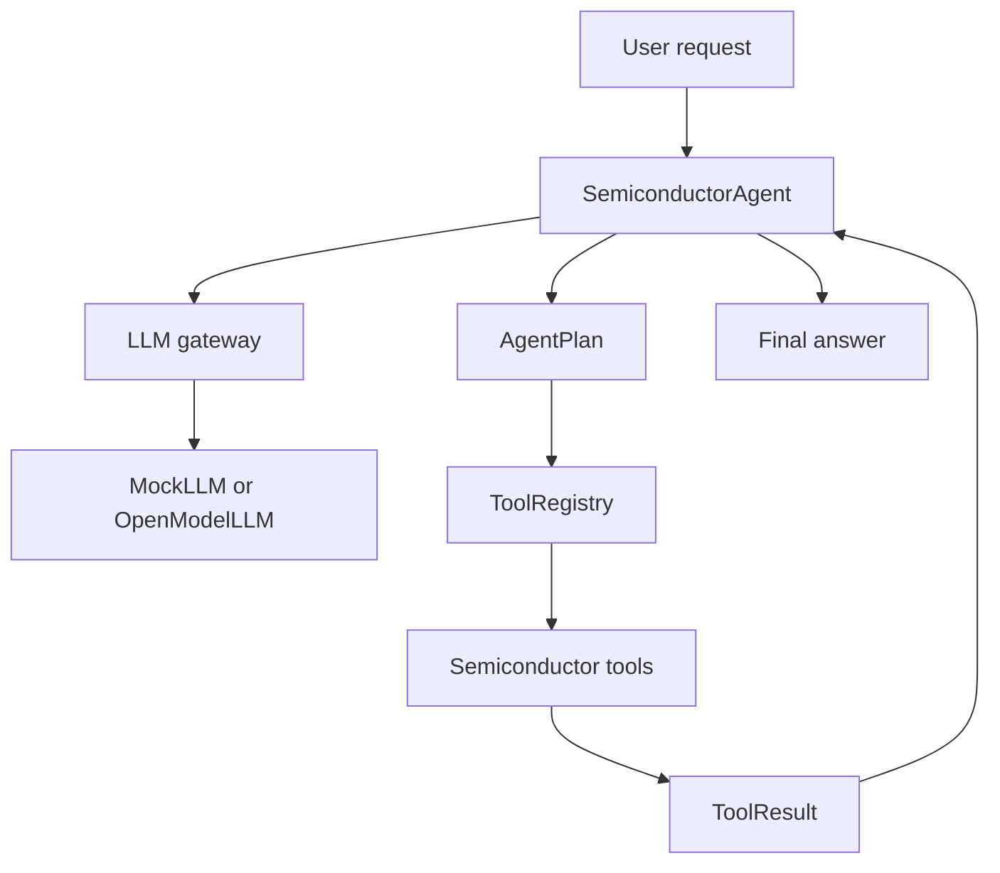

# Semiconductor Agent Guide

이 문서는 `semicon-agent` 프로젝트를 이해하고 확장하기 위한 운영 가이드다.
현재 구현은 production 분석 엔진이 아니라, LLM 기반 Agent 프레임워크를 검증하기
위한 MVP 구조다.

## 1. 목적

이 프로젝트의 목적은 반도체 데이터 분석 업무에서 사용할 수 있는 Agent 구조를
Python으로 구성하는 것이다.

현재 우선순위는 다음 순서다.

1. LLM 교체가 쉬운 구조
2. Agent가 tool을 선택하고 실행하는 구조
3. 반도체 분석 업무에 맞는 tool registry 구조
4. mock LLM으로 로컬 테스트 가능
5. 나중에 open-model API로 연결 가능

반도체 분석 함수는 현재 demo 수준이다. 실제 분석 정확도보다 Agent 흐름 검증이
중요하다.

## 2. 현재 상태

구현된 구성은 다음과 같다.

- `MockLLM`: 로컬 테스트용 deterministic LLM 대체 구현
- `OpenModelLLM`: OpenAI-compatible `/chat/completions` API adapter
- `SemiconductorAgent`: plan, tool execution, final synthesis 실행 코어
- `ToolRegistry`: Python 함수를 tool로 등록하고 실행
- `semiconductor.py`: profile, yield, SPC, anomaly, correlation, report demo tools
- CLI: `python -m semicon_agent`
- tests: pytest 기반 기본 회귀 테스트

아직 구현하지 않은 주요 항목은 다음과 같다.

- streaming response
- persistent memory
- human approval workflow
- workflow graph executor
- tracing dashboard
- FastAPI server
- web UI
- RAG/document ingestion
- production semiconductor analytics

## 3. 아키텍처



핵심 원칙은 LLM과 분석 함수를 분리하는 것이다. LLM은 어떤 tool을 호출할지
계획하고, 실제 계산은 Python tool이 담당한다.

## 4. 설치

프로젝트 루트에서 실행한다.

```powershell
python -m pip install -e ".[dev]"
```

필수 런타임 의존성은 다음과 같다.

- pandas
- numpy
- pydantic

개발용 의존성은 다음과 같다.

- pytest
- openpyxl

## 5. 실행

샘플 데이터로 수율과 SPC demo 분석을 실행한다.

```powershell
python -m semicon_agent "analyze yield and SPC" --data examples/sample_wafer.csv
```

종합 리포트를 실행한다.

```powershell
python -m semicon_agent "create an overall report" --data examples/sample_wafer.csv
```

전체 실행 payload를 JSON으로 확인한다.

```powershell
python -m semicon_agent "create an overall report" --data examples/sample_wafer.csv --json
```

## 6. Open-model API 연결

`OpenModelLLM`은 OpenAI-compatible chat completions API를 가정한다.

필요 조건은 다음과 같다.

- `POST /chat/completions`
- request body에 `model`, `messages`, `temperature` 지원
- response body에 `choices[0].message.content` 반환

실행 예시:

```powershell
$env:OPEN_MODEL_API_KEY="..."
python -m semicon_agent "analyze yield" `
  --data examples/sample_wafer.csv `
  --llm open-model `
  --base-url http://localhost:8000/v1 `
  --model my-open-model
```

환경변수로도 설정할 수 있다.

```powershell
$env:OPEN_MODEL_BASE_URL="http://localhost:8000/v1"
$env:OPEN_MODEL_NAME="my-open-model"
$env:OPEN_MODEL_API_KEY="..."
```

## 7. 주요 코드 위치

| 영역 | 파일 |
| --- | --- |
| Agent core | `semicon_agent/core/agent.py` |
| 실행 모델 | `semicon_agent/models.py` |
| LLM protocol | `semicon_agent/llm/base.py` |
| Mock LLM | `semicon_agent/llm/mock.py` |
| Open-model adapter | `semicon_agent/llm/open_model.py` |
| Tool base | `semicon_agent/tools/base.py` |
| Tool registry | `semicon_agent/tools/registry.py` |
| Semiconductor demo tools | `semicon_agent/tools/semiconductor.py` |
| CLI | `semicon_agent/cli.py` |
| Tests | `tests/` |

## 8. Agent 실행 흐름

1. 사용자가 자연어 요청을 입력한다.
2. `SemiconductorAgent.run()`이 context를 만든다.
3. LLM이 `AgentPlan`을 반환한다.
4. `AgentPlan.tool_calls`에 있는 tool을 순서대로 실행한다.
5. 각 실행 결과는 `ToolResult`로 저장된다.
6. LLM이 tool 결과를 받아 최종 응답을 만든다.

현재 `MockLLM`은 keyword 기반으로 tool을 선택한다. 실제 LLM을 연결하면 모델이
tool 설명과 schema를 보고 tool call 계획을 생성한다.

## 9. Tool 추가 방법

새 tool은 다음 순서로 추가한다.

1. Python 함수를 만든다.
2. `ToolSpec`으로 name, description, parameters, handler를 정의한다.
3. `build_semiconductor_tools()`에 등록한다.
4. mock LLM keyword rule이 필요하면 `MockLLM.plan()`에 추가한다.
5. tests를 추가한다.

예시:

```python
def wafer_map_summary(path: str) -> dict[str, object]:
    df = load_table(path)
    return {
        "kind": "wafer_map_summary",
        "row_count": len(df),
    }
```

등록 예시:

```python
ToolSpec(
    name="wafer_map_summary",
    description="Demo tool: summarize wafer map data.",
    parameters={
        "type": "object",
        "properties": {"path": {"type": "string"}},
        "required": ["path"],
    },
    handler=wafer_map_summary,
)
```

## 10. LLM adapter 추가 방법

새 provider를 붙이려면 `BaseLLM` protocol을 만족하면 된다.

필수 메서드는 다음 두 개다.

```python
def plan(user_request, tools, context) -> AgentPlan:
    ...

def synthesize(user_request, tool_results, context) -> str:
    ...
```

provider별 구현 예시는 다음과 같이 분리하는 것이 좋다.

- `semicon_agent/llm/ollama.py`
- `semicon_agent/llm/vllm.py`
- `semicon_agent/llm/lmstudio.py`
- `semicon_agent/llm/openrouter.py`

CLI에는 `--llm` 선택지를 추가한다.

## 11. 테스트

전체 테스트:

```powershell
python -m pytest
```

캐시 생성을 줄이고 실행:

```powershell
$env:PYTHONDONTWRITEBYTECODE='1'
python -m pytest -p no:cacheprovider
```

현재 테스트 범위는 다음을 확인한다.

- profile tool이 데이터 구조를 읽는지
- yield tool이 pass/fail을 계산하는지
- SPC demo tool이 기본 통계를 반환하는지
- anomaly demo tool이 이상치를 반환하는지
- correlation demo tool이 상관값을 반환하는지
- mock agent가 적절한 tool을 선택하는지
- report tool이 markdown을 생성하는지

## 12. 풀패키지 확장 로드맵

최신 Agent platform 수준으로 확장하려면 다음 순서가 현실적이다.

### Phase 1. Framework hardening

- structured plan schema 강화
- tool argument validation 강화
- error taxonomy 추가
- run history 저장
- CLI command 분리

### Phase 2. Provider layer

- Ollama adapter
- vLLM adapter
- LM Studio adapter
- OpenRouter adapter
- response streaming
- retry, timeout, rate limit

### Phase 3. Memory and artifacts

- SQLite run store
- artifact directory
- uploaded dataset registry
- previous analysis context retrieval

### Phase 4. Workflow engine

- graph 기반 multi-step workflow
- human approval node
- retryable tool node
- long-running job support

### Phase 5. Production interface

- FastAPI server
- background worker
- simple web UI
- auth boundary
- audit log

### Phase 6. Semiconductor tool packs

- wafer map parser
- lot/wafer/chip hierarchy analysis
- process parameter trend
- parametric test summary
- bin pareto
- defect clustering
- SPC chart data
- recipe/process comparison

현재 repository는 Phase 0/MVP에 해당한다.

## 13. 운영 기준

production으로 확장할 때는 다음 기준을 적용한다.

- LLM 응답을 신뢰하지 않는다.
- tool argument는 항상 validation한다.
- 파일 삭제, shell 실행, 외부 전송은 human approval을 둔다.
- 원본 데이터와 결과 artifact를 분리 저장한다.
- tool result는 재현 가능해야 한다.
- 분석 함수는 LLM 없이도 단독 테스트 가능해야 한다.
- 민감 데이터가 있으면 local model 또는 사내 API boundary를 우선한다.

## 14. 현재 한계

현재 구현은 다음을 보장하지 않는다.

- 실제 반도체 공정 통계의 정확성
- 대용량 파일 처리 성능
- 장기 memory
- concurrent execution
- user authentication
- audit/compliance
- production security boundary

따라서 현재 코드는 framework prototype으로 사용하고, 실제 업무 적용 전에는 위
로드맵의 hardening 작업이 필요하다.
